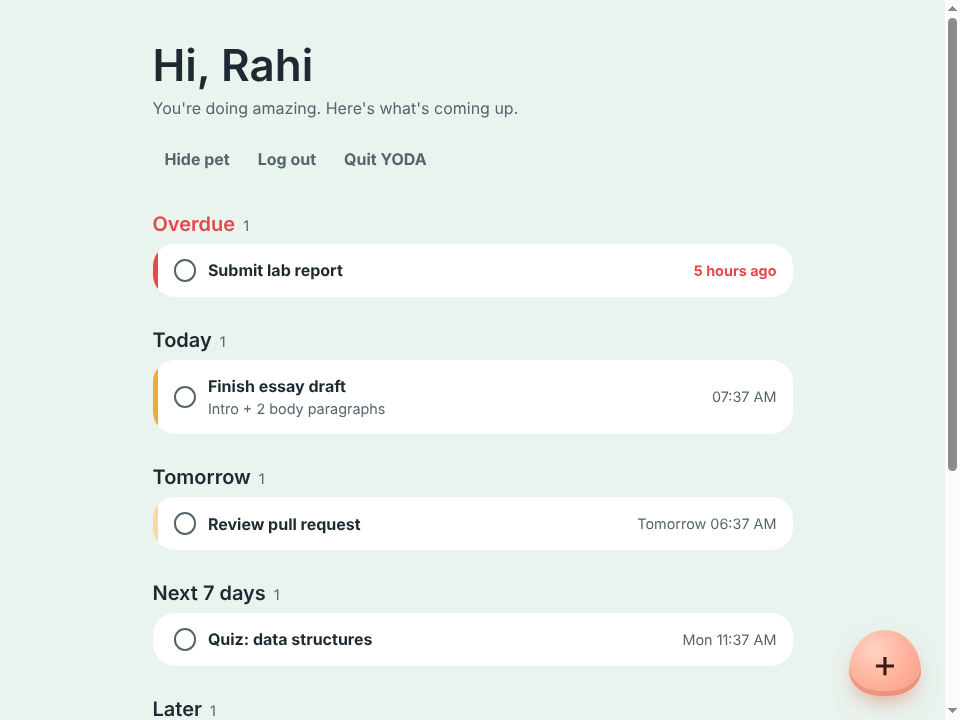
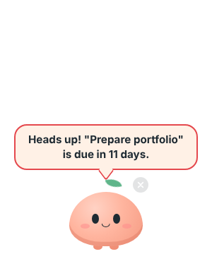
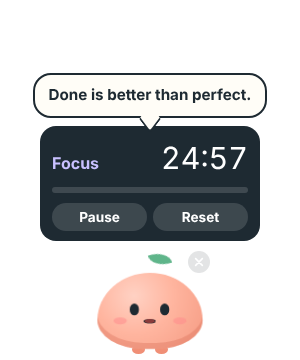

# YODA (YOu're Doing Amazing)

We all have those times when we feel dull, bored, and lonely while doing our routine. Hours of sitting in front of a computer to code a project, write an essay, or even organize our work can turn into painful activities we wish we could do less. Burning out because of a boring workflow is not rare, so we created YODA (You're Doing Amazing). YODA is your routine buddy that helps you keep your mood up while still acing your deadlines.

## Features

YODA is a desktop pet that does incredible things to keep you happy while you're dealing with complicated and boring tasks.

- **Deadline reminders:** Add your deadlines, and YODA becomes your trustworthy time-management partner, reminding you even when you've lost track of time.
- **Focus timer:** YODA helps you create focus periods with a structured timer designed for time blocking.
- **Health reminders:** What kind of buddy would YODA be if it didn't care about your health? It reminds you to take breaks and keeps you going when you're on the verge of giving up.

How to play with YODA on your desktop:

| Action | What happens |
|---|---|
| Hover | YODA hops and smiles |
| Click once | Opens the pomodoro timer (25 min focus / 5 min break), with a chime when time is up |
| Double-click | YODA says something encouraging in a comic speech bubble |
| Faint **×** (top right) | Hides YODA. The app keeps running and messages become system notifications |

<p>
  
  
  
</p>


## Tech Stack

| Layer | Technology |
|---|---|
| Frontend | React 19, Vite, React Router |
| Backend | Node.js, Express 5, zod (validation) |
| Database | PostgreSQL, Prisma ORM 7 |
| Auth | bcrypt (password hashing), JWT, email verification codes |
| Email | Nodemailer (SMTP) |
| Desktop | Electron, electron-builder (AppImage) |
| Tools | Git, GitHub, Prettier |

## Architecture

```
┌──────────────────────── Electron desktop app ─────────────────────────┐
│  Main process = "the brain"                                           │
│    • pomodoro timer         • deadline reminder polling (every 1 min) │
│    • health reminders       • notifier: speech bubble OR OS notification
│        ▲  IPC (preload.js bridge)          ▲  IPC                     │
│  Main window (React)                 Pet window (React, transparent)  │
│  login + agenda                      = "the face": only displays      │
└────────┬──────────────────────────────────────────────────────────────┘
         │ HTTPS + JSON (Bearer token)      ▲ main process also calls the API
         ▼                                  │ for due reminders
   ┌──────────────┐    Prisma    ┌────────────────┐
   │  Express API │ ───────────▶ │   PostgreSQL   │
   └──────────────┘              └────────────────┘
```

The web app (`client/`) also works on its own in a normal browser. Only the pet, the timer and reminders need the desktop app.

### How data flows

1. **Sign up.** The client sends name, email and password to `POST /api/auth/register`. The server hashes the password with bcrypt, stores a SHA-256 hash of a 6-digit code and emails the code (printed in the server console during development).
2. **Verify and log in.** `POST /api/auth/verify-email` checks the code and returns a JWT. The client keeps it in `localStorage` and, inside Electron, passes it to the main process through `preload.js`.
3. **Add a task.** `POST /api/items` saves the item and, if it has a deadline, creates up to three rows in `reminders` (3 days, 1 day and 3 hours before). Times already in the past are skipped.
4. **Get reminded.** Every minute the Electron main process calls `GET /api/reminders/due`. Each due reminder goes to the notifier, then is marked seen with `PATCH /api/reminders/:id/seen`.
5. **Notifier.** If the pet is visible, the message appears in its speech bubble (reminders jump the queue). If the pet is hidden, it becomes an OS notification.
6. **Timer and health reminders** run entirely in the main process, so they keep working while the pet is hidden or the main window is closed.

## Folder Structure

```
yoda-routine-buddy/
├── server/                    # Backend: REST API
│   ├── prisma/schema.prisma   # database tables
│   ├── prisma.config.js       # Prisma CLI config (reads DATABASE_URL)
│   └── src/
│       ├── config/            # validated environment variables
│       ├── routes/            # URL → middleware → controller
│       ├── controllers/       # read request, send response
│       ├── services/          # business logic (auth, items, reminders, email)
│       ├── middlewares/       # requireAuth, validate, rate limit, errors
│       ├── validators/        # zod schemas for request bodies
│       ├── utils/             # small helpers (JWT, codes, reminder times)
│       ├── lib/prisma.js      # shared database client
│       ├── generated/         # Prisma client (generated, not committed)
│       ├── app.js             # builds the Express app
│       └── server.js          # starts it
├── client/                    # Frontend: React (Vite)
│   └── src/
│       ├── api/               # fetch wrapper + API calls
│       ├── context/           # logged-in session
│       ├── desktop/bridge.js  # talks to Electron (no-op in a browser)
│       ├── pages/             # Register, VerifyEmail, Login, Main
│       ├── components/        # agenda, item modal, "+" button, form fields
│       ├── hooks/             # useClickOrDoubleClick
│       ├── utils/             # date formatting, agenda grouping
│       └── pet/               # pet window UI: Pet, Bubble, TimerPanel, CloseButton
├── desktop/                   # Electron
│   ├── assets/                # app and tray icons
│   └── src/
│       ├── main.js            # entry point: windows, IPC, starts the engine
│       ├── preload.js         # safe bridge exposed as window.yoda
│       ├── windows/           # main window, pet window
│       ├── engine/            # timer, deadline reminders, health reminders
│       ├── notifier.js        # bubble or OS notification
│       ├── session.js         # token received from the React app
│       └── tray.js            # tray menu
└── docs/                      # testing checklist, pre-deploy notes, images
```

## Getting Started

You need **Node.js 22.18 or newer** (the server runs Prisma's generated TypeScript directly) and **PostgreSQL**. Commands below work in bash, zsh and fish.

### 1. Database (Arch Linux)

```sh
sudo pacman -S postgresql
sudo -iu postgres initdb -D /var/lib/postgres/data
sudo systemctl enable --now postgresql
sudo -iu postgres psql -c "ALTER USER postgres PASSWORD 'postgres';"
sudo -iu postgres createdb yoda
```

### 2. Backend

```sh
cd server
cp .env.example .env        # then edit .env (at least JWT_SECRET)
npm install                 # also generates the Prisma client
npx prisma migrate dev --name init   # creates the tables (first time only)
npm run dev                 # http://localhost:3000
```

Check it: `curl localhost:3000/api/health` returns `{"status":"ok"}`.

Without SMTP settings, verification codes are printed in this terminal, in a `[DEV EMAIL]` block.

### 3. Web app

```sh
cd client
cp .env.example .env        # VITE_API_URL=http://localhost:3000
npm install
npm run dev                 # http://localhost:5173
```

### 4. Desktop app

Keep the backend and the web app dev server running, then:

```sh
cd desktop
npm install
npm run dev                 # loads the UI from http://localhost:5173
```

To run the desktop app with the built UI instead of the dev server:

```sh
npm run build:client
npm run start:dist
```

Build a Linux installer (AppImage) into `desktop/release/`:

```sh
npm run dist
```

Handy settings for testing (any of them can be combined):

```sh
YODA_FOCUS_MINUTES=0.2 YODA_BREAK_MINUTES=0.1 YODA_HEALTH_MINUTES=1 npm run dev
```

### 5. Hyprland (Wayland)

On Wayland the compositor, not the app, decides where windows go and whether they stay on top. Add rules for the pet window (title `yoda-pet`) to `~/.config/hypr/hyprland.conf`.

Hyprland **0.53 and newer**:

```ini
windowrule = match:title ^(yoda-pet)$, float on
windowrule = match:title ^(yoda-pet)$, pin on
windowrule = match:title ^(yoda-pet)$, no_blur on
windowrule = match:title ^(yoda-pet)$, no_shadow on
windowrule = match:title ^(yoda-pet)$, border_size 0
windowrule = match:title ^(yoda-pet)$, move 100%-w-24 100%-w-24
```

Hyprland **0.48 to 0.52**:

```ini
windowrule = float, title:^(yoda-pet)$
windowrule = pin, title:^(yoda-pet)$
windowrule = noblur, title:^(yoda-pet)$
windowrule = noshadow, title:^(yoda-pet)$
windowrule = noborder, title:^(yoda-pet)$
windowrule = move 100%-w-24 100%-w-24, title:^(yoda-pet)$
```

Check your version with `hyprctl version`, and the [window rules wiki page](https://wiki.hypr.land/configuring/core/rules/window-rules/) if a rule name was renamed. Then:

- **Notifications** need a notification daemon (mako, dunst or swaync). Test it with `notify-send "test" "hello"`.
- **Tray icon** appears only if your bar has a tray (for waybar, the `tray` module).
- To **move YODA**, hold `Super` and drag it (Hyprland's default floating-window move).

## Configuration

**server/.env**

| Variable | Default | Purpose |
|---|---|---|
| `PORT` | `3000` | API port |
| `DATABASE_URL` | (required) | PostgreSQL connection string |
| `JWT_SECRET` | (required, 32+ chars) | Signs login tokens |
| `JWT_EXPIRES_IN` | `7d` | Session length |
| `CORS_ORIGIN` | `*` | Allowed browser origins, comma separated |
| `TRUST_PROXY` | `0` | Set `1` behind Render, Railway, Nginx and similar |
| `SMTP_HOST`, `SMTP_PORT`, `SMTP_SECURE`, `SMTP_USER`, `SMTP_PASS`, `MAIL_FROM` | empty | Real email. Empty `SMTP_HOST` prints emails to the console |

**client/.env**: `VITE_API_URL`, the API base URL. It is baked in at build time.

**desktop** (environment variables when starting Electron): `YODA_DEV_URL`, `YODA_CLIENT=dist`, `YODA_POLL_MINUTES` (1), `YODA_HEALTH_MINUTES` (60), `YODA_FOCUS_MINUTES` (25), `YODA_BREAK_MINUTES` (5).

## API

All responses are JSON. Errors always look like `{ "error": { "code", "message", "details" } }`.

| Method | URL | Auth | Purpose |
|---|---|---|---|
| GET | `/api/health` | | Server is alive |
| POST | `/api/auth/register` | | Create account (`name`, `email`, `password`), send code |
| POST | `/api/auth/verify-email` | | Check `email` + `code`, returns `{ user, token }` |
| POST | `/api/auth/resend-verification` | | Send a new code (once a minute) |
| POST | `/api/auth/login` | | `email` + `password` → `{ user, token }` |
| GET | `/api/me` | ✓ | Current user |
| GET | `/api/items` | ✓ | All items, by deadline |
| POST | `/api/items` | ✓ | Create (`title`, `notes?`, `dueAt?`) + reminders |
| PATCH | `/api/items/:id` | ✓ | Update any of `title`, `notes`, `dueAt`, `isDone` |
| DELETE | `/api/items/:id` | ✓ | Delete item and its reminders |
| GET | `/api/reminders/due` | ✓ | Due, unseen deadline reminders |
| PATCH | `/api/reminders/:id/seen` | ✓ | Mark a reminder as shown |

## Technical Decisions

| # | Decision | Why |
|---|---|---|
| 1 | Main page is an agenda list grouped by time, not a calendar | Simplest to build, and it is exactly the data the pet needs. Calendar view is planned for v2 |
| 2 | PostgreSQL + Prisma | Relational data (user → items → reminders); readable schema and migrations |
| 3 | Electron, not Tauri | JavaScript only, no Rust; the pet is a second, transparent window |
| 4 | Reminders at 3 days, 1 day and 3 hours before; past ones are skipped | Created with the item, so the desktop app only has to ask "what is due?" |
| 5 | Passwords hashed with bcrypt, never encrypted | A hash cannot be reversed; the server never needs the original password |
| 6 | 6-digit email codes: SHA-256 hashed, 15-minute expiry, 5 attempts, 60-second resend cooldown | Short-lived codes are safe with a fast hash once attempts are limited |
| 7 | Unverified accounts may register again; verifying logs you in | Fixes typos without support, and saves one step |
| 8 | JWT bearer token in `localStorage`, no cookies | Works the same in the browser and Electron; allows `CORS_ORIGIN=*` |
| 9 | Prisma 7 with the pg driver adapter; the generated client is TypeScript run directly by Node | No build step for the server. Requires Node 22.18+ |
| 10 | zod validation and one error format for every endpoint | The client can show field errors and react to stable error codes |
| 11 | Rate limit on auth endpoints, helmet headers | Basic protection against brute force before deploying |
| 12 | All time-based logic lives in Electron's main process | It keeps running while the pet window is hidden |
| 13 | Notifier: speech bubble if the pet is visible, OS notification if hidden | One place decides where messages go |
| 14 | Closing the × only hides the pet; closing the main window only hides it; tray and relaunch bring them back | The app keeps reminding you in the background |
| 15 | Single vs double click told apart with a 250 ms delay | Browsers fire `click` before `dblclick` |
| 16 | Timer counts down from a fixed end time, not by counting ticks | No drift when ticks are delayed |
| 17 | Pet window grows only while the bubble or timer is open | Transparent areas still block clicks to windows behind them |
| 18 | Health reminders on a simple interval (60 min by default) | The app can't reliably know if you are working; idle detection is planned for v2 |
| 19 | Several due reminders for one item become one message, worded from the real time left | Avoids "3 days left" spam after the app was closed for a while |
| 20 | HashRouter (`/#/login`) | Works on any static host and from `file://` inside Electron without server rules |
| 21 | Desktop code is CommonJS | Electron's sandboxed preload script must be CommonJS; one module style for the whole folder |
| 22 | The Electron main process keeps the token in memory only | Nothing secret written to disk; the React app re-sends it on start |
| 23 | Timer chime generated with the Web Audio API | No audio file to ship or license |
| 24 | Pet is drawn in CSS (an original peach "mochi" with a leaf) | Placeholder that can be replaced later without touching logic |
| 25 | UI text in English | Matches the README and the portfolio audience |
| 26 | Pet window title `yoda-pet` and a fixed `desktopName` | Stable names for Hyprland window rules |

## Testing and Deploying

- Manual test checklist: [docs/TESTING.md](docs/TESTING.md)
- What to check before deploying: [docs/PRE-DEPLOY.md](docs/PRE-DEPLOY.md)

## Troubleshooting

| Problem | Fix |
|---|---|
| Server exits with "Invalid environment variables" | Fill in `server/.env` (copy from `.env.example`) |
| `Cannot find module .../generated/prisma/client.ts` | Run `npx prisma generate` in `server/` |
| `P1001: Can't reach database server` | Start PostgreSQL: `sudo systemctl start postgresql` |
| Web app shows "Can't reach the YODA server" | Is the API running? Is `VITE_API_URL` right? Restart `npm run dev` after editing `.env` |
| Reminders never arrive in the desktop app | Log in inside the desktop app (not only in a browser). If `localhost` misbehaves on your machine, use `http://127.0.0.1:3000` |
| Pet has a black or white box around it | Transparency depends on the compositor; on Hyprland add the `no_blur`/`no_shadow` rules above |
| No notification when the pet is hidden | Install and start a notification daemon (mako, dunst, swaync) |
